# connect to products table and fetch data

### task list 1 - add to cart

For this update, remove / comment out the existing code that is in cart.php

#### 1-1 add tables to DB
In order to handle cart data, we need to add our cart tables to our database.  We've already made the SQL for it to add to your existing data
1. Open the accompanying “cart.sql” file in your editor
1. copy all of the data
1. go to your mysql client (phpmyadmin)
1. select your wicked-sales database
1. go to the SQL tab
1. paste the cart.sql data into the sql tab
1. click go
1. there should now be a cart and cartItems tables in your wicked sales database

#### 1-2 update your schema
Whenever we update our design, we need to update our schema to reflect it so we can always have a clear picture of what our database is
-go to dbdesigner.net
- remove the image field from your product table (it is now in your images table
- add the cart table and attached fields
- add the cartItems table and attached fields
- add foreign key constraints.  In this case cartItems productId attaches to products ID and cartITems cartId attaches to cart ID.
#### 1-3 update functions.php with json body pulling function
We will often need to grab json post data from the body of incoming messages, so we're going to update our helper functions with a function to do this
1. Update functions with getBodyData to get body data and convert from json to variables (you did this in a prototype to get data)

Make new files
- in the same folder as cart.php
- add cart_add.php
- add cart_get.php

#### 1-4 prevent direct access of sub-files 
We often break up functionality into other files.  We don't want these sub-files to be accessed directly.  One way to do this is to make a variable in the head file (cart.php) that is checked for in the sub files (cart_add.php and cart_get.php)

1. In cart.php Create a new [constant](https://www.php.net/manual/en/function.define.php), INTERNAL, set to value true
1. In cart_add.php
    1. Check if the constant INTERNAL is defined.  See the "defined" function in php.net
        - If yes, exit (not throw an error).  Make sure to print a message not about not allowing 1. direct access
    -- do example test
1. In cart_get.php
    1. Check if the constant INTERNAL is defined.  See the "defined" function in php.net
        - If yes, exit (not throw an error).  Make sure to print a message not about not allowing 1. direct access
    -- do example test

#### 1-5 fill out basic start up of cart.php
We need to load helper functions, db connection file, and set our error handler
1. in cart.php
1. Require functions.php
1. Set your error handler
1. Require your connection file

#### 1-6 set up PHP sessions
Remembering data between calls of our files is important for many uses, like remembering which shopping cart is yours.  So in this case we will store our cartID into sessions, like storing it into localstorage in JS.  If cartID is there, we will grab it, otherwise we will set it to false so we know we need to generate it later
1. At the top of your cart.php file, [Start a session](https://www.php.net/manual/en/function.session-start.php)
1. Below your error handler set, make a conditional to test if ```$_SESSION[‘cartId’]``` is empty.  Read more about the ```$_SESSION``` [SESSION superglobal here](https://www.php.net/manual/en/reserved.variables.session.php)
    - If not empty, store ```$_SESSION[‘cartId’]``` into a variable $cartID
    - If empty, store false into the variable

#### 1-7 check method uses to access cart
We want to see which method was used to access this file.  This allows the client to communicate to us which action to take with our cart.  POST will add things to the cart, GET will grab the entire cart for the current user.
1. in Cart.php, below the db connection, Make a switch
    1. It takes in the ```$_SERVER``` [SERVER superglobal](https://www.php.net/manual/en/reserved.variables.server.php) “REQUEST_METHOD”
    1. If POST, it requires cart_add.php
    1. If GET, it requires cart_get.php
---- do example test

#### 1-8 check for product id
Since we are adding a product to the cart, we need to know which product to add.  The client should have sent us that ID, so we are going to look in the body for that ID
    1. In cart_add.php towards the top
    1. Use the getBodyData function to get the json body, store to variable $product_id
    1. Parse int the $product_id variable to sanitize it, check if it is greater than 0, throw an error otherwise
    -- do example test
    1. See if id came in the json body data, and store it into a variable, $product_id, if it did, 


    1. Make a query to get the price from products for the given id you got from the body json
    1. Send the query to the database and store the result
    1. Make sure result is valid
    1. Check how many rows came back.  Throw an exception if there isn’t one.  It wasn’t a valid product id
    1. Extract the data for the row from the database, store the results into productData
    1. Send a query to the database with the words [“START TRANSACTION”](https://dev.mysql.com/doc/refman/8.0/en/commit.html), this will start a mysql transaction set of queries that can be “rolled back” or “committed” 
    1. Check to make sure the transaction was started by testing the result
    1. If our cart ID is false
        1. Make an insert query to insert a new entry into the cart table
        1. Do NOT specify the id, that is auto incrementing
        1. Specify ‘created’ as being equal to the mysql function NOW()
        1. Insert queries take two forms:
            - [SET form (easy-insert)](http://milov.nl/2836)
            ```
            INSERT INTO <table> SET <key>=<value>, <key2>=<value2>, <key3>=<value3>
            ```
            - [VALUES form (multi-insert)](https://www.w3schools.com/sql/sql_insert.asp)
            ```
            INSERT INTO <table> (<key>, <key1>,<key2>) VALUES (<value>,<value2>,<value3>)
            ```
            - The latter can have multiple sets of values inserted, while the former is more clear to humans
            - Multiple: 
                ```
                INSERT INTO <table> (<key>, <key1>,<key2>) VALUES (<value>,<value2>,<value3>), (<2value>,<2value2>,<2value3>), (<3value>,<3value2>,<3value3>)
                ```
        1. Send your query to mysql and get the result
        1. Check if your result is valid or throw an error
        1. Use [mysqli_affected_rows](https://www.php.net/manual/en/function.mysql-affected-rows.php) to see if a row was inserted or not.  Should be  1, throw an error otherwise.  This is a different command than you use for SELECT! (mysqli_num_rows)
        1. Use [mysqli_insert_id](https://www.php.net/manual/en/mysqli.insert-id.php) to get the id of the car that was created, store it into both cartId and ```$_SESSION[‘cartId’]```
    1. Note that we are now out of the previous if statement if cartId was false
    1. Just once (this won’t happen again every time you run this code), modify your cartItems table.  We're going to add a [unique index](https://www.tutorialspoint.com/mysqli/mysqli_indexes) to your table
        1. Click on the “Indexes” link, it will expand
        
        1. Change 1 to 2 for “Create an index on _____ columns”, then click go
            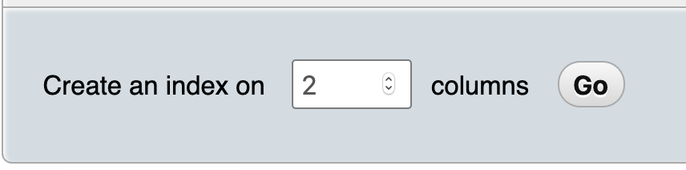
        1. It doesn’t really matter what you name it
        1. In the dialog that pops up, make sure the first column is “productID”
        1. Make the second column “cartID”
        1. Make sure it is an index choice of “unique”
        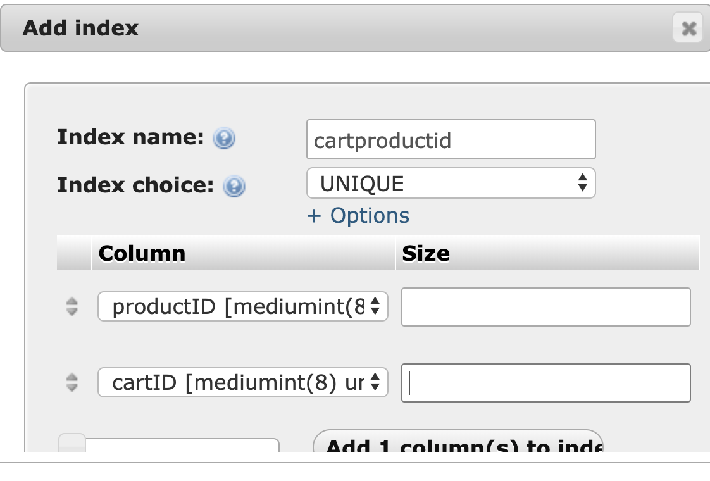
        1. Click go to confirm this index
        1. You should now see the following under indexes
            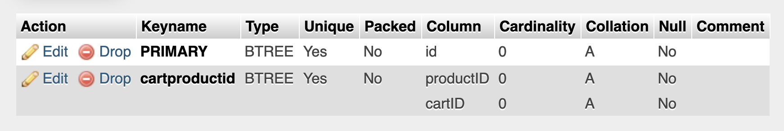
    1. Make a query to insert data into the cartItems table
        1. Add count=1
        1. Add productID = the id you were passed in and sanitzed
        1. Add price = the price you got from the product table earlier
        1. Add added = NOW()
        1. cartID = the ID you got either from SESSIONS or from the insert previously
        1. Add a new bit onto the end of this query “[ON DUPLICATE KEY UPDATE](https://dev.mysql.com/doc/refman/8.0/en/insert-on-duplicate.html)”
        1. Below this, as if you were adding more data, specify adding the following
        1. Add count = count + 1, yes, you can use field names like variables and add to them from previous amounts
        1. Your query should now have this general form:
            ```
            INSERT INTO <table> SET <key>=<value>, <key2>=<value2> ON DUPLICATE KEY UPDATE <key>=<value>, <key2>=<value2>
            ```
        1. This allows you to either insert or update in one query depending on if there is already an existing index or not.  In this case, the index you specified above
        1. Send your query to mysql and get the result back
        1. Test the result and act appropriately
        1. Check to make sure your query updated AT LEAST 1 row.  DUPLICATE KEY updates sometimes report updating 2 rows since they tried to insert first.
        1. If not, send this query to mysql: “ROLLBACK” (this will undo the first cart insert so you don’t have partial inserts)
        1. Throw an exception now as normal
        1. Your query is now complete, we need to finalize the transaction: send to mysql this: “COMMIT”
        1. At this point, we are done with cart_add.php

### task list 2 - get from cart
1. In cart_get.php
    1. Add our INTERNAL check like in cart_add
    1. Check if ```SESSION[‘cart_id’]``` is empty
        - If it is, print a json encoded empty array
        - Exit to stop processing, we have no cart for this person
    1. Set the $cartId variable to the SESSION cart_id.  To be safe, we probably should intval it, too
    1. Write a query that fetches the appropriate data as found in dummy-cart-items.json
        - You’ll need a join with products table to get data from there
        - You’ll need a subquery to get the first image from images table
        - You’ll need to only get the cart where the cart ID is the one you are looking for
    1. Send the query to mysql and get the result
    1. Retrieve the data you got from the query and print it out.  If there is nothing there, make sure it prints out an empty array

### TESTING your endpoint:

#### General Testing notes:
- Your session is being stored in cookies, to clear your cookies when starting again, you’ll need to delete them in postman.  More about [PHP Session Cookies here](https://www.guru99.com/cookies-and-sessions.html)
    1. Click Cookies under Send
        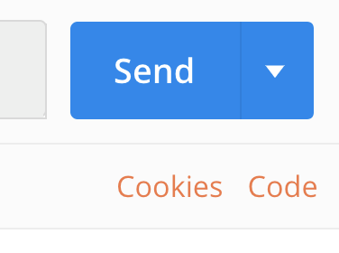
    1. In the dialog that pops up, find the one for localhost with a name of PHPSESSID (this is where PHP session cookies are stored)
        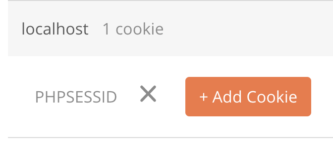
    1. Click the X to get rid of it
- It will often be necessary to set your database data back to baseline.  You’ll need to truncate it in PHPMyAdmin
    1. Find the “operations” button in the menu.  If your menu is too small, it may be under “More”
        
    1. At the bottom, click on Truncate,  NOT DROP (truncate empties the data and resets auto increment values to 1)
        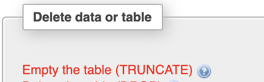
    1. Click OK to confirm
#### Testing sessions
It can often be beneficial, when working with SESSION and cookies, to have a file that can show you the current state of the session.
    - make a file, I often call it showsession.php
    - start the session inside the file
    - print_r the ```$_SESSION``` superglobal


### Testing instructions
1. Add a cart item, give it no cart id
    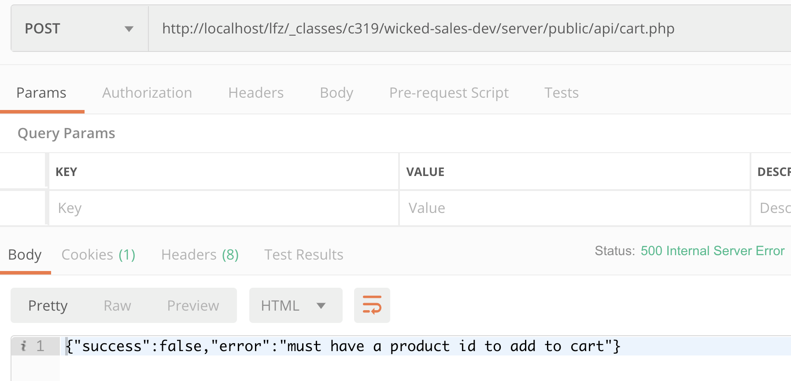
1. Add a cart item, give it an id in the query data, not the body data
    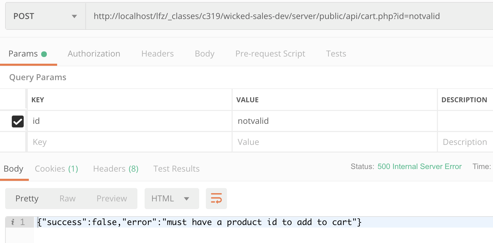
1. Add a cart item, give it an id of “notvalid” in the body data as json encoded
    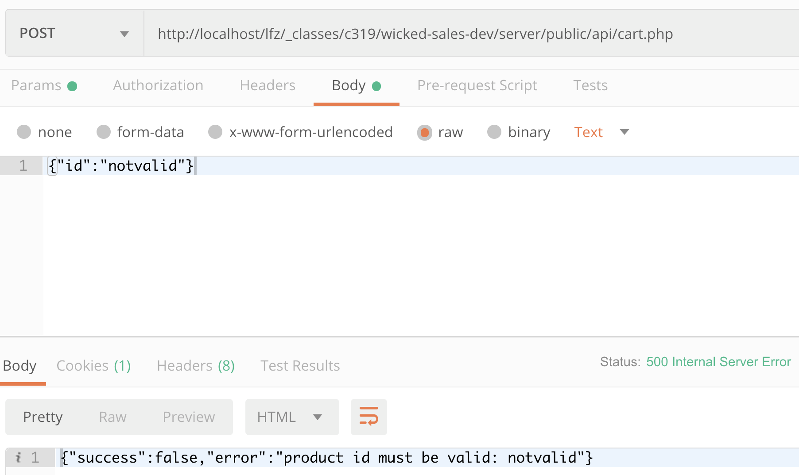
1. Add a cart item, give it an id of a product that doesn’t exist
    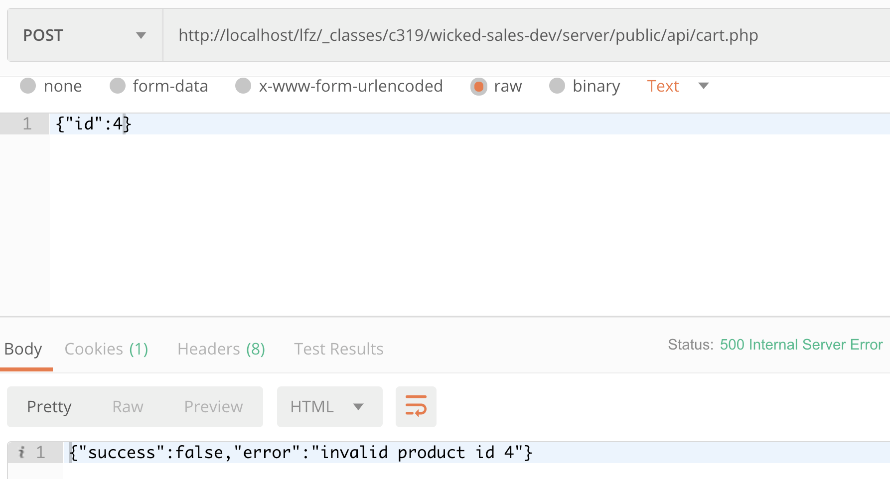
1. Add a cart item, give it a proper id in the body data, id 1
    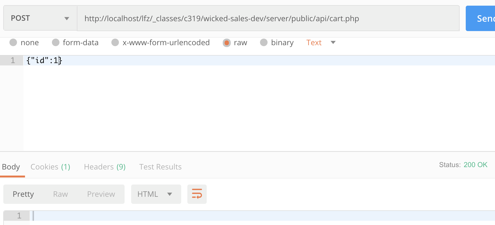
    1. Check your cart
        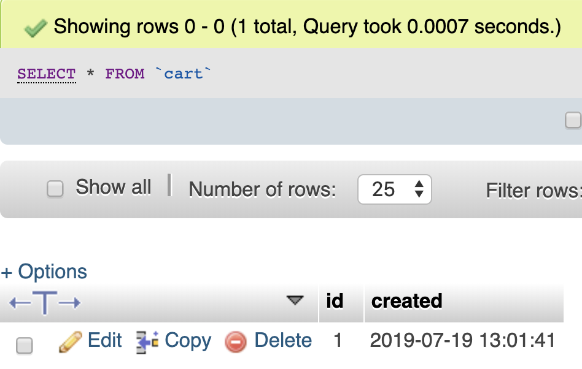
    1. Check your cartItems
        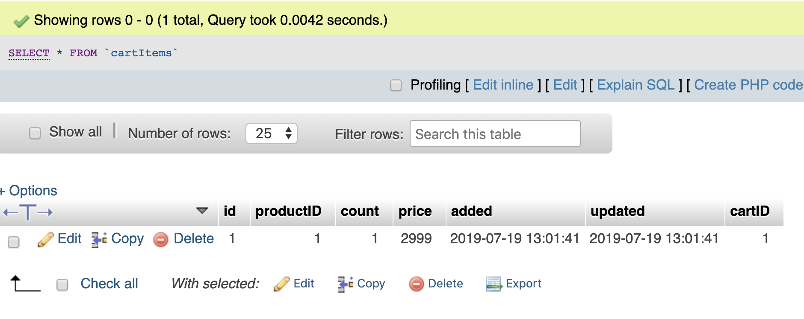    
1. Add a cart item, with a proper id of 2
    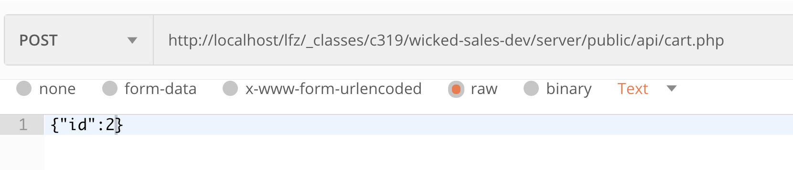
    1. Check your cartItems
        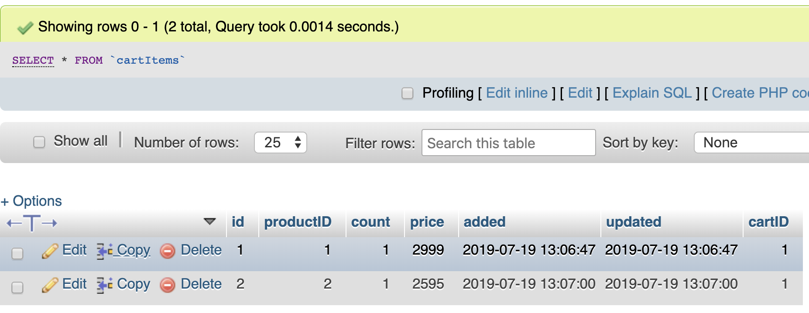
1. Add a cart item with id 1 AGAIN
    1. Check your cartItems
        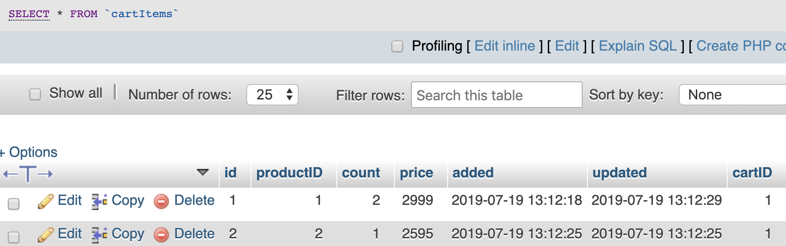
1. Make a GET request to cart.php
    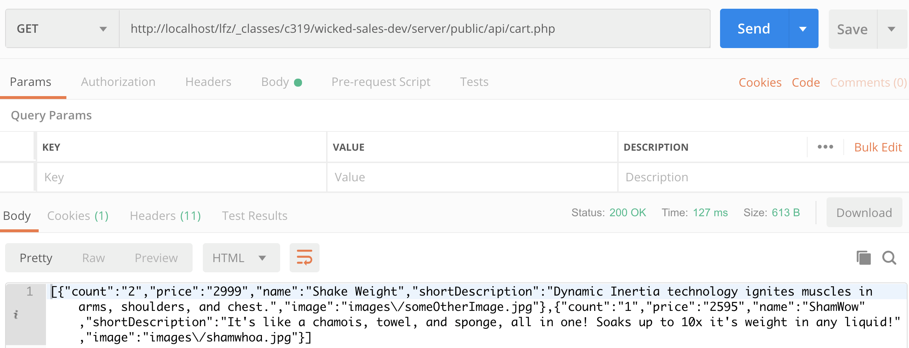

